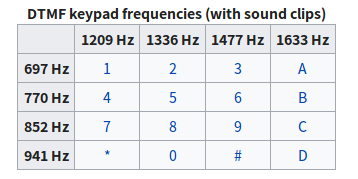
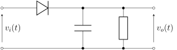

## Backgrounds

The DTMF technology converts the input number into a signal which contains two components with different frequencies. By using band pass filters and envelope detectors, the components in the signals can be recognized.



The structure of an analog envelope detector is shown below.



## Results

The result this DTMF program is as follows :

```octave
octave:1> main
START RECEIVING NUMBERS.
"18983016725"
PRINTING RECEIVED SIGNAL:
1 8 9 8 3 0 1 6 7 2 5

octave:2> main
START RECEIVING NUMBERS.
"0011386"
PRINTING RECEIVED SIGNAL:
0 0 1 1 3 8 6
```

after that, the generated wave is played via the encapsuled sound playing API.

```octave
%% play the sound
sound(vec_x,SOURCE_FREQ);
```


<div STYLE="page-break-after: always;"></div>

## Implementation Details

### Function: vec_cos = costable(vec_input)

The alternative cosine function includes a generated table with 256 numbers, and the error is further reduced by applying linear interpolation between the 256 samples.

This cosine algorithm is widely used in some database software for its performance both in speed and precision. The maximum error of this program is 0.0001.

```octave
%% cosine function with 256-element table and linear interpolation
function vec_cos = costable(vec_input)
    TABLE_SIZE = 256;
    %% generate a table containing 256 elements
    vec_time256 = linspace(0,2*pi*(TABLE_SIZE-1/TABLE_SIZE),TABLE_SIZE);
    vec_costable = cos(vec_time256);
    %% getting position and interpolation
    vec_input           = mod(vec_input,2*pi) / (2*pi/TABLE_SIZE);
    vec_input_int       = floor(vec_input) .+ 1;
    vec_input_exceed    = vec_input - vec_input_int;
    %% initialize an array
    vec_cos = zeros(1,length(vec_input_int));
    for i = 1:1:length(vec_input_int);
        pos_table   = vec_input_int(i);
        %%tmp_exceed for linear interpolation
        tmp_exceed  = vec_input_exceed(i) * ((vec_costable(mod(pos_table+1,TABLE_SIZE)+1)) - vec_costable(pos_table));
        vec_cos(i)  = vec_costable(pos_table);
    end
end
```


<div STYLE="page-break-after: always;"></div>

### Frequency Detector with FFT

The DFT of the original signal is stored in fft_x, and the intensity of some key frequencies are compared to get the main components in the signal.

Window is not used to get the highest resolution on frequency domain.

```octave
fft_x = abs(fft(vec_x)) ./ (SOURCE_TIME*SOURCE_FREQ);
amp_697  = fft_x(floor(697 * SOURCE_TIME + 1));
amp_770  = fft_x(floor(770 * SOURCE_TIME + 1));
amp_852  = fft_x(floor(852 * SOURCE_TIME + 1));
amp_941  = fft_x(floor(941 * SOURCE_TIME + 1));
        
amp_1209 = fft_x(floor(1209 * SOURCE_TIME + 1));
amp_1336 = fft_x(floor(1336 * SOURCE_TIME + 1));
amp_1477 = fft_x(floor(1477 * SOURCE_TIME + 1));
        
ampmax_l = max([amp_697,amp_770,amp_852,amp_941]);
ampmax_h = max([amp_1209,amp_1336,amp_1477]);
```

Then the number is recovered from the two main wave components in the original signal.

```octave
if(ampmax_l == amp_697)
	if(ampmax_h == amp_1209)
    	result_num = 1;
    elseif(ampmax_h == amp_1336)
        result_num = 2;
	else
        result_num = 3;
    end
end
...
```


<div STYLE="page-break-after: always;"></div>
