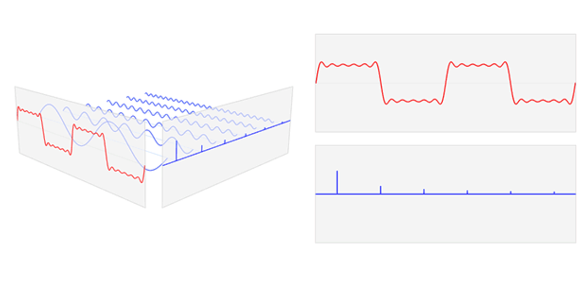
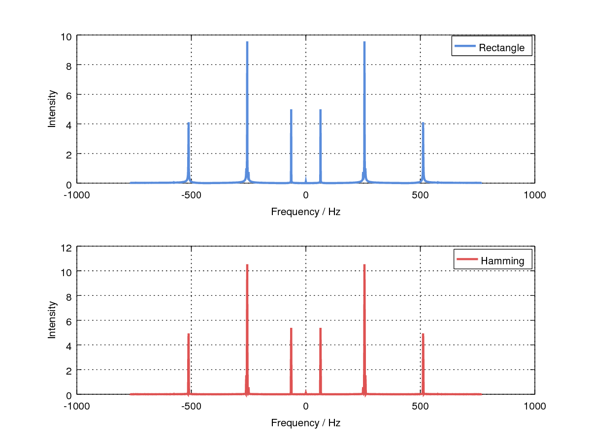
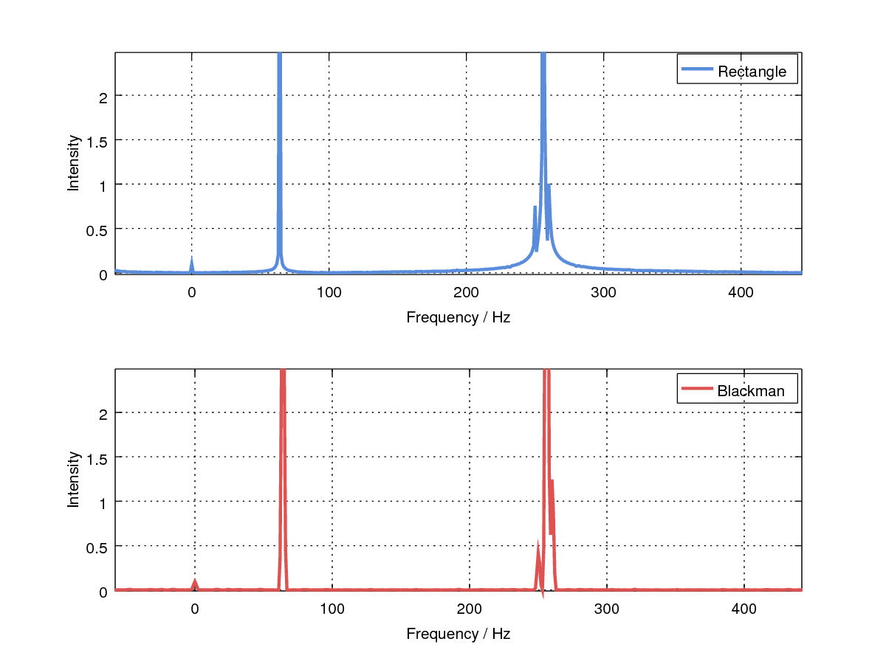
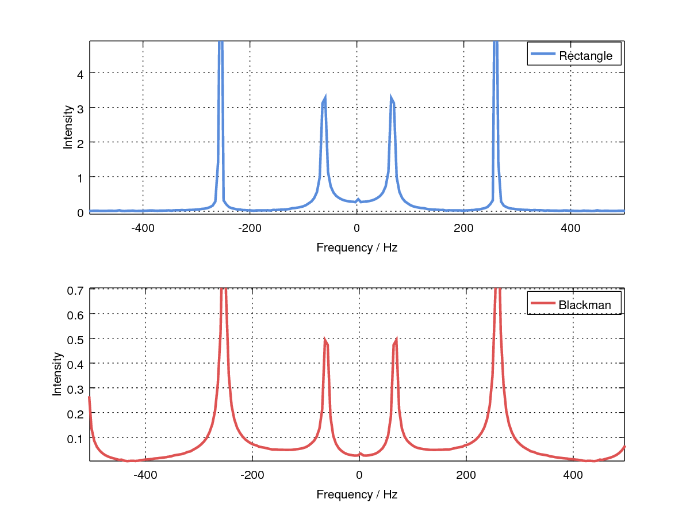

## Backgrounds

Spectrum analysis is a conversion from time-domain to frequency-domain, and a spectrum contains a lot of information which is hard to find on time-domain.



By using *Cooley-Tukey FFT* algorithm, both the time and space complexity of calculating DFT of a sequence is reduced to an acceptable amount for real-time signal processing.
In practice, the FFT gets advantages in precision than direct compution.

To do the spectrum analysis, the built-in FFT function in Matlab / Octave is called to do the DFT, and the DFT sequence is converted to an easy-to-read form by shifting.


<div STYLE="page-break-after: always;"></div>

## Results

**Comparing different windows applied before FFT**

After Hamming window is applied to the original signal, the resolution of the spectrum decreased slightly, but the energy leakage on other frequencies is also reduced.



The diagram below use Blackman window instead. Blackman window function has lower side lobe gain and wider main lobe width. Compared with the signal windowed with hamming window function, the leakage is further reduced and there's also more imapct on the resolution. 



**Effect of Reducing DFT Length**

Reducing the DFT length will significantly decrease the resolution of the spectrum, from the diagram the overlapping of components with similar frequencies is obvious compared with the diagrams above.



<div STYLE="page-break-after: always;"></div>

## Implementation Details

**Signal Sampling**

```octave
%% Parameters
FREQ_SAMPLE  = 1536;
TIME_SAMPLE  = 1;
NUM_SAMPLE   = floor(FREQ_SAMPLE*TIME_SAMPLE)+1;
LENGTH_DFT   = 1537; %% equals to NUM_SAMPLES

%% Signal Generating
vec_t = linspace(0,TIME_SAMPLE,NUM_SAMPLE);
vec_x = 10*sintable(2*pi*64*vec_t) + ...
        1*sintable(2*pi*250*vec_t) + ...
        20*sintable(2*pi*256*vec_t) + ...
        3*sintable(2*pi*260*vec_t) + ...
        10*sintable(2*pi*512*vec_t);
```

Some key parameters, such as sampling rate and sampling time, are shown in the first lines of the program.

Function `sintable(vec_phase)` is an alternative function using table-interpolation method.

  

**Windowing**

```octave
%% Windowing
vec_x2 = vec_x .* blackman(length(vec_t))';
```

Windowing is implemented by directly call the built-in window functions.

  

**Spectrum Analysis**

```octave
%% FFT Spectrum Analyze
fft_x = fftshift(fft(vec_x,LENGTH_DFT)) ./ LENGTH_DFT;
frange_x = linspace(-FREQ_SAMPLE/2,FREQ_SAMPLE/2,LENGTH_DFT);
    
fft_x2 = fftshift(fft(vec_x2,LENGTH_DFT)) ./ LENGTH_DFT;
frange_x2 = linspace(-FREQ_SAMPLE/2,FREQ_SAMPLE/2,LENGTH_DFT);
```

Spectrum analysis is done by FFT, and it is converted to easy-to-read format by fftshift.
