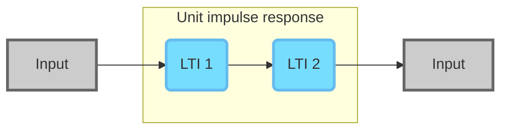

# 信号与系统

### 第二章 线性时不变系统

**1. Discrete-Time Input / 离散输入信号**

输入信号可被视为一系列脉冲的集合，即：
$$
x[n] = \sum^{+\infty}_{k = -\infty}x[k] \delta[n-k]
$$
其中，$x[k]$为相应位置的值，$\delta[n-k]$为相应位置的单位脉冲。

另外，离散单位阶跃函数可被表述为：
$$
u[n] = \sum^{+\infty}_{k = 0}\delta[n-k]
$$
**2. Discrete-Time Impulse Response / 离散信号冲激响应**

单位冲激响应函数(Impulse Response Function)，$h[n]$，描述线性时不变系统对单位脉冲函数作为输入时的输出。

上图为输入信号，下图为输出信号。

  

**3. Convolution Sum / 卷积和**

将式(1)中的冲激函数$\delta[n-k]$替换为单位冲激响应函数$h[n-k]$，得到卷积和：
$$
y[n] = \sum^{+\infty}_{k = -\infty}x[k] h[n-k] = x[n] * h[n]
$$
该式可被视为分布在$x[n]$中的脉冲，分别被转换为相应位置( 即$n-k$ )具有相应幅度( 即$x[n]$ )的脉冲响应，相加得到$y[n]$。

对于连续信号，仅需按照套路，将输入信号视为无限多脉冲的和，并修改式(3)，即可得到连续函数的卷积和：
$$
y(t) = \int^{+\infty}_{-\infty}x(\tau) h(t- \tau) d\tau = x(t) * h(t)
$$

  

**4. Properties of Convolution / 卷积特性**

- 符合交换律(commutative)：$x[n]*h[n] = h[n]*x[n]$ 。
- 符合分配律(distributive)： $x[n]*(h_1[n]+h_2[n]) = x[n]*h_1[n]+x[n]*h_2[n]$ 。
- 相互不存在运算优先级。

  

**4e. Unit Step Response / 阶跃响应**

阶跃响应由式(5)得到
$$
s[n] = u[n] * h[n]
$$

**5. LTI system with other properties / 具有其他特性的LTI系统**

此段描述依赖于第一章/基本系统属性。

- Memory(less) / (非)记忆系统

一个非记忆LTI系统具有此形式的脉冲响应: $h[n] = K\delta[n]$

  

- Invertibility / 可逆性

一个可逆的LTI系统存在$h_{inv}[n]$，使得$h[n]* h_{inv}[n] = \delta[n]$

- Causality / 因果性

一个具有因果性的LTI系统，其单位脉冲响应不应位于n>0上，如第二条图中所示响应描述的系统不具有因果性。

  

- Stability / 稳定性

一个具有稳定性的LTI系统具有以下特性：
$$
\int_R |h(\tau)| d(\tau) < \infty
$$
即其单位脉冲响应在整个时域上可积。