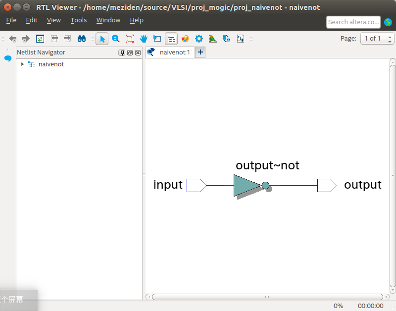
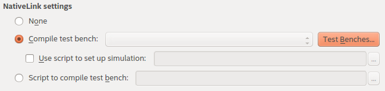
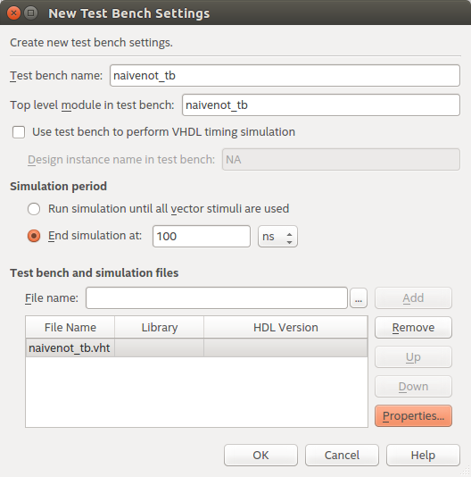
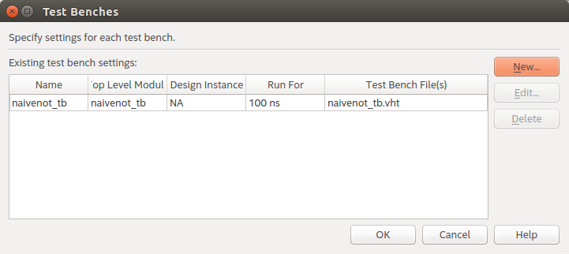
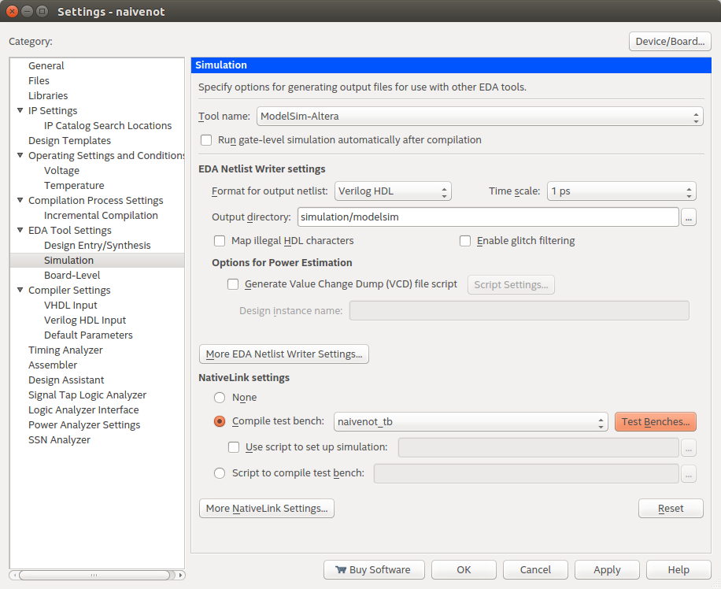
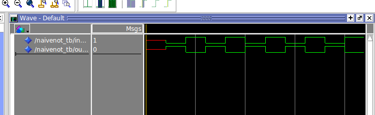

# MOGIC / VLSI Design

**第0节 VHDL, Testbench与Quartus + ModelSim仿真**

### 前言

关于VHDL的基本操作的请最好参阅*Free Range VHDL*一书，它讲到了大部分编写VHDL时的语法与相关注意事项，但请勿照抄其示例代码，因为一小部分代码因为软件语法检查/作者笔误并不能在Quartus上被综合。

该文档中的代码均在Quartus II 18.0综合通过，请放心食用。

### VHDL / naivenot模块的实现

上一个文档中提到了建立一个名为naivenot.vhd的空文档与naivenot这个模块相关联，但没有具体将其实现。

以下是一个简单的非门VHDL实现，由于这并不属于正式笔记的一部分，具体的语法细节将在接下来的文档中呈现。

```vhdl
-- 包含的库文件，定义了数据类型与一些基本操作
library IEEE;
use IEEE.std_logic_1164.all;
use IEEE.numeric_std.all;

-- entity，实体部分，定义了一个模块的输入与输出
entity naivenot is
port
(
	input		:in 	std_logic;
	output		:out 	std_logic
);
end naivenot;

-- architecture，定义了一个模块内部的具体实现方法
architecture rtl of naivenot is
begin
	output <= (not input);
end rtl;
```

将该文件编写完成后，就可以进行综合(Synthesis)，在较慢的电脑上，该过程可能持续半分钟。

综合通过后，可以在Tools > Netlist Viewer > RTL Viewer中查看综合结果。



  

### Testbench的编写

此处鄙人没有使用自带的testbench生成器，因为该方法并不优雅，鄙人新建了一个VHDL文件，在项目文件夹下另存为naivenot_tb.vht。

正常情况下的testbench具有以下特点：

- 空的entity
- architecture中包含一个组件声明与一个/多个对应的实例，及其port map接口映射。
- 包含至少一个信号发生过程(process)，通常名为clk_gen等等。

针对该naivenot实体所设计的testbench如下所示：

```vhdl
library IEEE;
use IEEE.std_logic_1164.all;
use IEEE.numeric_std.all;

-- empty entity
entity naivenot_tb is
end naivenot_tb;

architecture rtl of naivenot_tb is
-- component declaration
component naivenot
	port
	(
		input		:in 	std_logic;
		output	:out 	std_logic
	);
end component;

-- signal declaration
signal input_tb,output_tb :std_logic;

begin
	-- component connections (parameters first,then arguments)
	gate_tb:naivenot port map(input=>input_tb,output=>output_tb);

	-- input signal generating
	sig_gen:process
	begin
		wait for 2ns;
		input_tb <= '0';
		wait for 2ns;
		input_tb <= '1';
		wait for 2ns;
		input_tb <= '0';
		wait for 2ns;
		input_tb <= '1';
	end process;
end rtl;
```

  

### 将Testbench与ModelSim仿真绑定

在Assignment > Settings >Simulation中，可以找到如下设置项，点击Test Benches。



填写testbench的顶层实体名(Top-Level Entity)以确保读取到正确的实体，在该示例中使用naivenot_tb，并将上一步的naivenot_tb.vht文件加入到testbench文件列表中。



保存设置。



最后确认您的testbench已经设置为您的配置。



设置完成，naivenot_tb.vht现已成为naivenot的testbench。

  

### 启动ModelSim仿真

在naivenot综合通过后，在工具栏Tool > Run Simulation Tool中找到RTL Simulation，ModelSim就会按照设置读取前面配置好的testbench(naivenot_tb.vht)，仿真结果如下图所示。



至此，一个简单的naivenot模块仿真就完成了。
