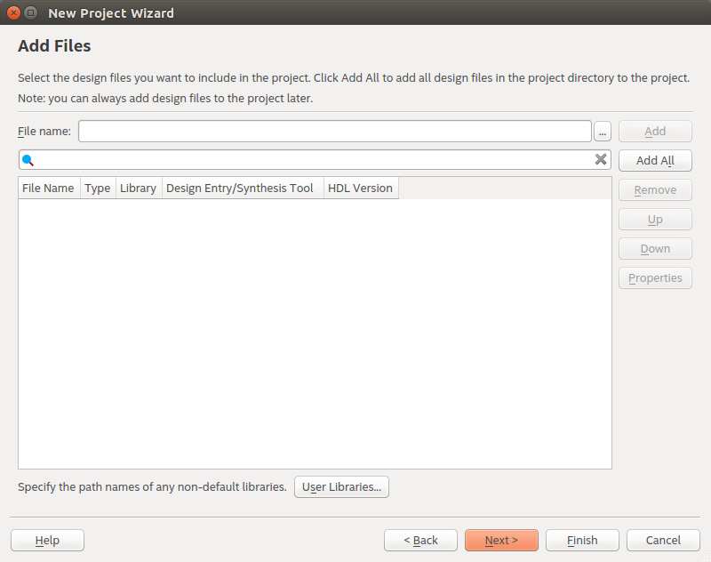

# MOGIC / VLSI

**公共益品计划 / 超大规模集成电路设计(VLSI Design) 笔记仓库 0号**

  

### 前言

建议诸位使用新版，基于Qt打造的Quartus II 18.0，以获取可定制化的界面以及与该教程更好的兼容性。

鄙人推荐使用*Free Range VHDL*，以及*Digital Design and Computer Architecture*以提高您的VHDL水平，结合电路设计的客观因素进行社会实践。

若有说明不详之处还请诸位指出，以便提升文档质量。李辛迅、张思明祝您学习愉快。

  

### Quartus + ModelSim 环境配置

**Windows**

请直接下载最大的那个文件以快速解决问题。

如果您是拷贝其他人的已安装版本，有可能需要更改系统环境变量或修改软件内的license配置，使其指向安装文件夹下的.../license/license.txt，以免无法启动软件。

**GNU/Linux**

由于modelsim软件没有64位版本，如果您使用64位Linux操作系统，需要安装一些32位兼容库，包括：

```shell
sudo apt install lib32z1 libstdc++6:i386 libncurses5:i386 libxft2:i386 libxext6:i386 libx11-6:i386
```

该指令在Ubuntu 16.04 LTS测试通过，使用清华大学TUNA镜像站。

  

### 工程创建

在工具栏>新建一个项目，即出现以下界面，指引着迷失的探索者勇敢前行。


Quartus现在就要求您指定您的项目名称及所在文件夹，还有Top-Level Entity，即顶层模块名。

在这个示例中，它的名字，叫naivenot，意为“简单的Not-Gate”。

需要注意的是，描述naivenot模块的VHDL文件最好被取名为naivenot.vhd，以免Quartus与您纠缠不清。


在该示例中选择空项目。


如果您已经有了描述naivenot的*.vhd文件，请将其添加到此处。

在该示例中忽略该选项，因为现在假设您对它还不够了解。



如果您已经购买了一颗FPGA的开发板，请在此将其正确配置。

截至目前鄙人的开发板没有到货，所以无法对此进行详解，若有不便还请海涵。


在工程创建完成时，由于我们并未添加文件，所以点击界面左边的naivenot模块会提示找不到文件，解决该问题的办法即新建一个VHDL文件，并将其另存为(File > Save as...)我们需要的路径。

该模块的VHDL描述文件名需要与顶层模块(Top-Level Entity)相互对应。


接着您的界面就会如下所示，naivenot.vhd现已与naivenot模块相关联。


到此为止，工程的配置就已完成。

  

### 杂项

**ModelSim-Altera与Quartus的关联**

如果您使用完整的安装包进行配置，这个配置会被自动解决。

如果您的配置不正常，需要调节的位置包括两处：

1. Tools > Options > EDA Tool Option


2. Assignment > Settings > Simulation


 
